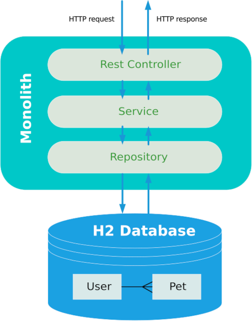
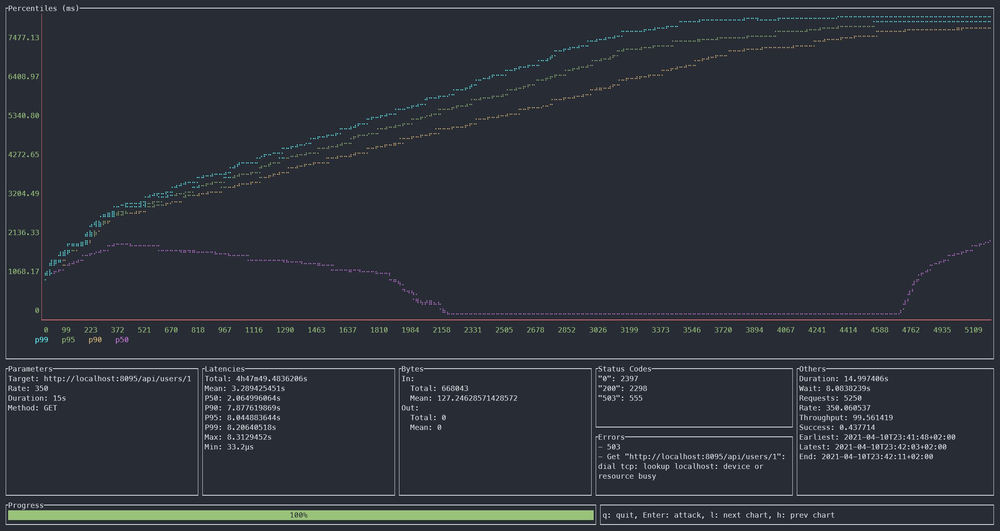

# Cloud Native Workshop - Unblock your applications

## Chapter 1 - The monolith

In the first chapter we start with our legacy monolith. We will look at the basic design and get to know the problems of this architecture.

### Architecture



### Problems

Our monolith suffers from two fundamental problems: On the one hand, there is a very high latency until the response is available, and on the other hand, there are frequent failures due to the unavailability of the database service.

This error behavior is simulated in our code by the [Chaos Service class](./monolith/src/main/java/com/swisscom/clouds/workshop/monolith/services/ChaosService.java).

#### Latency

The latency in the response is achieved by putting the thread in a wait state by applying ```Thread.sleep()```.

```java
public int applyLatency() {
    int latency = calculateLatency();
    try {
        Thread.sleep(latency);
    } catch (InterruptedException e) {
        e.printStackTrace();
    }

    return latency;        
}

private int calculateLatency() {
        return random.nextInt(
            chaosProperties.getMaxLatency() - 
                chaosProperties.getMinLatency() + 1)
                + chaosProperties.getMinLatency();
    }
```

The duration of the sleep period in milliseconds is randomly determined an lies between a minimum and maximum value which is configurable in your ``application.yaml``.

```yaml
chaos:
  min-latency: 1000
  max-latency: 2000
```

#### Database unavailability

The problem of the unavailable database is mocked by an exception which is thrown at a certain probability.

```java
public void checkDatabaseUnavailableException() {
    if (random.nextDouble() < chaosProperties.getExceptionProbability()) {
        log.error("Database is not available");
        throw new DatabaseUnavailableException();
    }
}
```

The probability of throwing this exception is also configurable in the ``application.yaml`` file.

```yaml
chaos:
  exception-probability: 0.2
```

### Looking at the tests

A look at the tests is always very helpful to understand an application. Unfortunately, the tests are missing for our legacy monolith. We will definitely do better then when we build our microservices.

### Run the monolith

Let's start our monolith either from your preferred IDEA or directly from the command line. You will find the code under ``chapter-01/monolith``.

```shell
# run from Mac or Linux
./gradlew bootrun

# run from Windows
gradlew.bat bootrun
```

Now you can send a request to get a user. The configured server port for our monolith is 8095. Feel free to use your preferred command line tool or GUI program to invoke the request.

```shell
http localhost:8085/api/users/1
```

```json
Connection: keep-alive
Content-Type: application/json
Date: Sat, 10 Apr 2021 21:21:07 GMT
Keep-Alive: timeout=60
Transfer-Encoding: chunked

{
    "email": "swilloway0@bluehost.com",
    "firstName": "Skipp",
    "id": 1,
    "lastName": "Willoway",
    "latency": 1277,
    "pets": [
        {
            "id": 1,
            "name": "Molly",
            "species": "Dog (Beagle)"
        },
        {
            "id": 2,
            "name": "Shadow",
            "species": "Cat (British Longhair)"
        },
        {
            "id": 3,
            "name": "Lucky",
            "species": "Budgie "
        }
    ]
}
```

Bear in mind that you might very well encounter an error, as there is alway a 20 % of our unavailable database exception. Just resend the request until you get a successful response with the user. 

```json
HTTP/1.1 503
Connection: close
Content-Type: application/json
Date: Sat, 10 Apr 2021 21:27:01 GMT
Transfer-Encoding: chunked

{
    "error": "Service Unavailable",
    "message": "",
    "path": "/api/users/1",
    "status": 503,
    "timestamp": "2021-04-10T21:27:01.600+00:00"
}
```

### Performance Test

Now we would like to know how well our monolith is actually performing. To do this, we will fire a series of http requests at the monolith using our HTTP Load tool ``ali``. As parameters we define a test duration of 15 seconds with a load of 350 requests per second.  

```shell
ali --duration 15s --rate=350 http://localhost:8095/api/users/1
```



The results are rather disappointing. Only 44% of the requests were processed successfully. For the rest, either our database exception was thrown or there was no thread available to process the request. While the exact figures will vary based on the performance of the used infrastructure, the general picture will remain the same.

This reveals the main problem of our architecture: Since a thread is simply blocked during the long delay and is not available for other tasks, there is a high risk that our system will not have enough threads available during heavy loads.

This is exactly what we will address with the reactive programming paradigm in the next chapters!