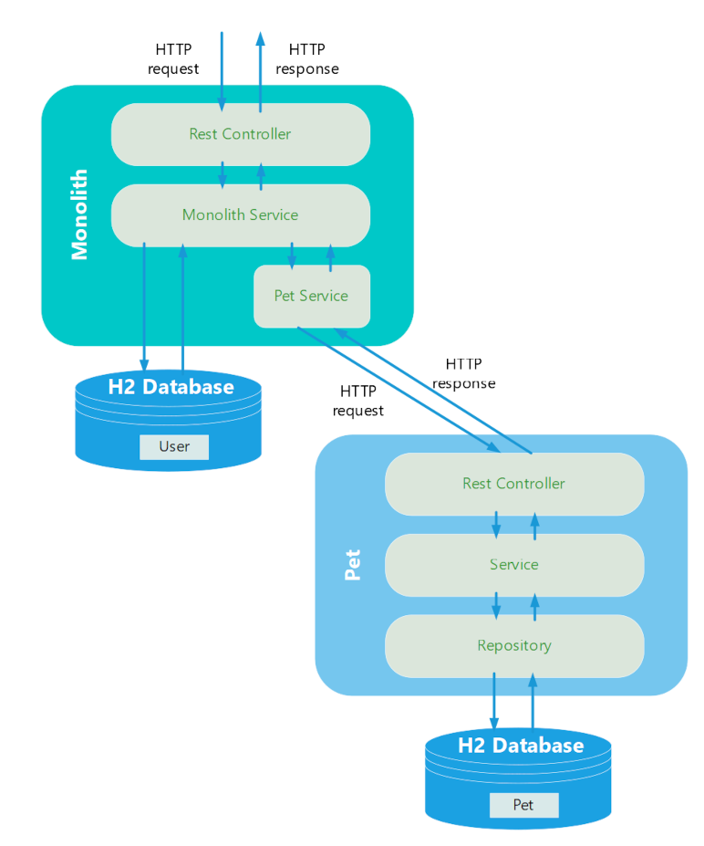

# Cloud Native Workshop - Unblock your applications

## Chapter 2 - Start splitting the monolith

In this chapter we will perform an intermediate step  start to split our monolith. We will learn about the Strangler pattern and build our first microservice using Spring Web Flux. With the learnings in this chapter you will then be able to conduct the hands-on exercises in chapter 3. 

### How to split the monolith

A very comprehensive collection and guidelines can be found at Fowler's [How to break a monolith](https://martinfowler.com/articles/break-monolith-into-microservices.html). The strangler pattern is again explained by Fowler in [Strangler Fig Application](https://martinfowler.com/bliki/StranglerFigApplication.html) or in many other source like the blog entry [Strangler fig pattern](https://docs.microsoft.com/en-us/azure/architecture/patterns/strangler-fig) from Microsoft. 


### Reactive Programming 

A comprehensive explanations of the concepts of reactive programming and reactive streams is far beyond this session. However, a first good overview on reactive streams is provided in the blog post [Spring Reactive Stream Basic concepts](https://medium.com/@AnkurRatra/spring-reactive-stream-basic-concepts-mono-or-flux-part-1-baed4b432977). This blog also covers the basics very well and also refers to the [The Reactive Manifesto](https://www.reactivemanifesto.org/). A great source is of course the documentation of the [Project Reactor](https://projectreactor.io/docs/core/release/reference/#intro-reactive) itself on which Spring Web Flux is based on.  

Some basic characteristics:
 - Asynchronous programming
 - Stream (producing data, transforming data, consuming data)
 - Reactive Streams (Iterator and Observer pattern, data arriving over time)
 - Flux and Mono as producers


### Flux and Mono Examples

The asynchronous nature of reactive programming can be quite confusing in the beginning. It is important to understand that a definition of a Mono or a Flux is just a declaration. As long as there is no subscriber, nothing happens. The following two examples illustrates this behavior. 

Let's start with the Mono:

```java
Mono<String> myMono = 
    Mono.just("Hello")
        .doOnSuccess(myString -> log.info("Text {} successfully processed", myString));

log.info("I am already here");

myMono.subscribe(result -> log.info("Result = {}", result));
```

```shell
# Output from the code above
22:28:25.384 [main] INFO com.swisscom.clouds.workshop.Application - I am already here
22:28:25.389 [main] INFO com.swisscom.clouds.workshop.Application - Text Hello successfully processed
22:28:25.391 [main] INFO com.swisscom.clouds.workshop.Application - Result = Hello
```
And let's do a similar example also for a Flux:

```java
Flux<Integer> myFlux = 
    Flux.just(1, 2, 3);
        .doOnEach(value -> log.info("Current step is {}", value));

log.info("I am already here");

myFlux.subscribe(result -> log.info("Result = {}", result));
```

```shell
# Output from the code above
22:36:15.687 [main] INFO com.swisscom.clouds.workshop.Application - I am already here
22:36:15.693 [main] INFO com.swisscom.clouds.workshop.Application - Current step is doOnEach_onNext(1)
22:36:15.693 [main] INFO com.swisscom.clouds.workshop.Application - Result = 1
22:36:15.693 [main] INFO com.swisscom.clouds.workshop.Application - Current step is doOnEach_onNext(2)
22:36:15.693 [main] INFO com.swisscom.clouds.workshop.Application - Result = 2
22:36:15.693 [main] INFO com.swisscom.clouds.workshop.Application - Current step is doOnEach_onNext(3)
22:36:15.693 [main] INFO com.swisscom.clouds.workshop.Application - Result = 3
22:36:15.694 [main] INFO com.swisscom.clouds.workshop.Application - Current step is onComplete()
```


### Architecture




### The reactive Pet microservice 

The entire call chain of the HTTP request is now handled reactively. 

#### Repository

```java
@Repository
public interface PetRepository extends ReactiveCrudRepository<Pet, Integer> {
    public Flux<Pet> findAllByUserId(int userId);
}
```

#### Service

```java
public Flux<Pet> getAllPetsForUserId(int userId) {

    //
    // The unreliable network sometimes results in
    // an unavailable database
    //
    chaosService.checkDatabaseUnavailableException();

    return petRepository.findAllByUserId(userId);
}
```

#### Pet Controller

```java
@GetMapping("users/{userId}/pets")
public Flux<Pet> getAllPetsForUserId(@PathVariable int userId) {
    log.info("--> Start new Pet Controller request with user id = {}", userId);

    return petService
            .getAllPetsForUserId(userId)
            .log(getClass().getName());
}
```

#### Unit tests

The unit tests are performed with Mockito and the StepVerifier. In the example below, the repository is mocked to test the Pet service. The resulting flux can then be verified with the help of the StepVerifier.

```java
@Test
@DisplayName("Get existing pets by user ID returns Flux with pets")
public void getAllExistingPestForUserId() {

    Pet pet1 = new Pet();
    pet1.setId(PET_ID_1);
    Pet pet2 = new Pet();
    pet2.setId(PET_ID_2);
    Mockito.when(petRepository.findAllByUserId(USER_ID)).thenReturn(Flux.just(pet1, pet2));		
    PetService petService = new PetService(petRepository, chaosService);

    Flux<Pet> result = petService.getAllPetsForUserId(USER_ID);

    StepVerifier
        .create(result)
        .expectNextMatches(returnedPet -> returnedPet.getId() == PET_ID_1)
        .expectNextMatches(returnedPet -> returnedPet.getId() == PET_ID_2)
        .expectComplete()
        .verify();
}
```
### The adapted monolith

The monolith was adapted to only process the users directly and to call the newly created microservice to get the pets. 

```java
public User getUserForId(int userId) {

        //
        // The monolith is still slow but we know now
        // that the exceptions came from the pets. 
        //
        int latency = chaosService.applyLatency();

        Optional<User> userOptional = monolithRepository.findById(userId);
        return userOptional
                .map(user -> this.setLatency(user, latency))
                .map(this::addPetsForUser)
                .orElseThrow(() -> {
                    throw new UserNotFoundException(userId);
                });
    }

    private User addPetsForUser(User user) {
        user.setPets(petService.getPetsForUserId(user.getId()));;
        return user;
    }
```

The PetService class in our monolith uses a simple RestTemplate to fetch the pets via http call. 

```java
@Service
public class PetService {

    private final MonolithProperties monolithProperties;
    private final RestTemplate restTemplate;

    public PetService(MonolithProperties monolithProperties) {
        this.monolithProperties = monolithProperties;
        this.restTemplate =  new RestTemplateBuilder().build();
    }

    public List<Pet> getPetsForUserId(int userId) {
        String petServiceUrl = String.format(monolithProperties.getPetServiceUrl(), userId);  
        Pet[] pets = restTemplate.getForObject(petServiceUrl, Pet[].class);
        return Arrays.asList(pets);
    }
}
```

### Run the our microservice and the monolith

We have to start our adapted monolith as well as our newly created PET microservice . You can agin start them either from your preferred IDEA or directly from the command line. You will find the code for the monolith under ``chapter-02/monolith`` and the code for the Pet microservice under ``chapter-02/pets``. Start both applications as shown below. 

```shell
# run from Mac or Linux
./gradlew bootRun

# run from Windows
gradlew.bat bootRun
```

Now you can send a request to get a user. The configured server port for our monolith is still 8095. Feel free to use your preferred command line tool or GUI program to invoke the request.

```shell
http http://localhost:8095/api/users/2
```

```json
HTTP/1.1 200 OK
Content-Length: 185
Content-Type: application/json

{
    "email": "flavarack1@weebly.com",
    "firstName": "Francisco",
    "id": 2,
    "instanceId": 0,
    "lastName": "Lavarack",
    "latency": 1588,
    "pets": [
        {
            "id": 4,
            "name": "Harley",
            "species": "Dog (Husky)",
            "userId": 2
        }
    ]
}
```

Bear in mind that you might very well encounter an error, as there is always a 20 % of our unavailable database exception. Just resend the request until you get a successful response with the user. 