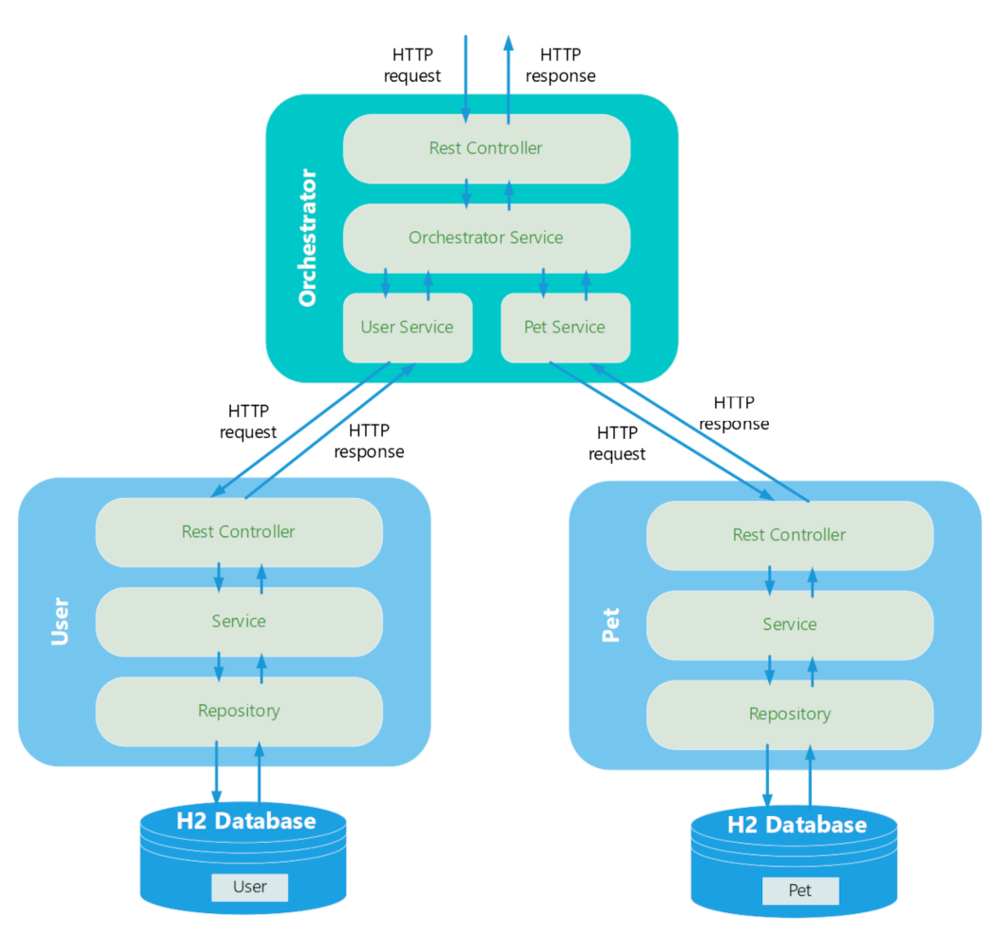
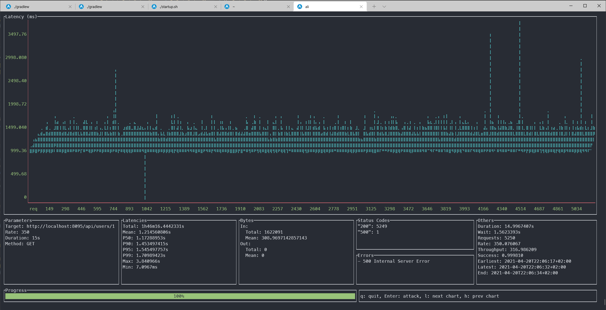

§# Cloud Native Workshop - Unblock your applications

## Chapter 3 - Finalize our microservice setup

In this chapter we will create our second microservices for the pets and we will replace our monolith with an orchestration service. This setup will also enable us to address the issue of the long response times to get the pet data.  

### Architecture




### Hands-on part 

The code is not complete yet and you are asked to complete the missing parts of the code. As depicted in the architecture overview, we have now 3 applications: ``chapter-03/orchestrator`` orchestrates the two microservices User and Pets and combines their results together. The user microservice is available under ``chapter-03/user`` whereas the pets microservice can be found under ``chapter-03/pets``.

The unit tests are quite complete and they might help you to verify your added code. 

### User microservice 

#### UserService class

Here we would like to set the latency and the instanceId (which is an attribute of our UserService class) into our user entity. The method ``setInstanceIdAndLatency`` has already been prepared for this step. 

```java
public Mono<User> getUserById(int userId) {

    //
    // This service is just slow ...
    //
    int latency = chaosService.getLatency();

    return userRepository.findById(userId)
        .delayElement(Duration.ofMillis(latency));
}

private User setInstanceIdAndLatency(User user, int latency) {
    user.setInstanceId(instanceId);
    user.setLatency(latency);
    return user;
}

```

<details>
<summary>Hint 1</summary>
We need to apply an operator to our stream that enables us to alter our user object.
</details>

<details>
<summary>Hint 2</summary>
Maybe you can try and google for "reactor update object". And it does not make that much of a difference if is a flux or a mono for this case.
</details>


#### UserController class

The user controller is already quite fine. But what happens, if there was no user found? In that case we would like to throw a ``UserNotFoundException`` to return a 404 HTTP status code.  

```java
@GetMapping("{userId}")
public Mono<User> getUserById(@PathVariable int userId) {
    log.info("--> Start new User Controller request with user id = {}", userId);

    return userService
            .getUserById(userId)
            .log(getClass().getName());
}

```

<details>
<summary>Hint 1</summary>
What do you think do we get back when there was no user? An Optional can contain null and a mono? 
</details>

<details>
<summary>Hint 2</summary>
So if a mono is empty, is there something to "switch" it?
</details>

<details>
<summary>Hint 3</summary>
Now, we only want the exception to be thrown if there is really no user. Maybe we need to "defer" things a bit. 
</details>

### Orchestrator microservice 

#### PetService class

The pet microservice still has that annoying 503 exception. We really think it is a transient error and can thus be easily overcome. 

```java
public Flux<Pet> getPetsForUserId(int userId) {
    return webClient.get()
            .uri(uriBuilder -> uriBuilder
                    .path(orchestratorProperties.getPetServicePath())
                    .build(userId))
            .retrieve()
            .bodyToFlux(Pet.class);
}
```

<details>
<summary>Hint 1</summary>
Check for transient errors on the internet in case you are not sure anymore what they actually are. The appropriate method in the WebClient class is then quickly found. But there is maybe even a better solution, even though it is a bit more complicated. 
</details>

<details>
<summary>Hint 2</summary>
Maybe you can check for "backoff" and why this is a good idea compared to a simple retry. 
</details>

<details>
<summary>Hint 3</summary>
A RetryBackOffSpec seems to be exactly what I need now. 
</details>

#### OrchestratorService class

Somehow a method got forgotten. Which operator helps me to add the pets to my user?

```java
public Mono<User> getUserWithPetsForId(int userId) {
    return userService
        .getUserById(userId)
        .???
        .map(tuple -> setPetListForUser(tuple.getT1(), tuple.getT2()));
}

private Mono<List<Pet>> getPetsForUserId(int userId) {
    return petService
            .getPetsForUserId(userId)
            .collectList();
}
```

<details>
<summary>Hint 1</summary>
The result of the required operator is a Tuple.  
</details>

<details>
<summary>Hint 2</summary>
We are looking for something where "zip" a user "with" the pets. 
</details>


#### UserService class

This one is admittedly a little difficult. The user microservices still faces issues with long latencies. We now have this microservice redundantly available in different zones. Maybe we can call different zones in parallel and then only use the first reply? The zones are represented by different ports in our example and the class is actually already quite well prepared. Which reactive operators in the ``getUserById`` method could help me to fulfil those requirements? 

```java
public UserService(OrchestratorProperties orchestratorProperties, WebClient.Builder webClientBuilder) {
    this.orchestratorProperties = orchestratorProperties;
    this.webClient = 
            webClientBuilder
                .baseUrl(orchestratorProperties.getUserServiceUrl())
                .build();
}

public Mono<User> getUserById(int userId) {
    return Flux.fromIterable(orchestratorProperties.getUserServicePorts());
}

private Mono<User> queryBackend(int port, int userId) {
    return webClient.get()
            .uri(uriBuilder -> 
                    uriBuilder
                        .port(port)
                        .path(orchestratorProperties.getUserServicePath())
                        .build(userId))
            .retrieve()
            .onStatus(httpStatus -> 
                        HttpStatus.NOT_FOUND.equals(httpStatus),    
                        clientResponse -> Mono.error(new UserNotFoundException(userId)))
            .bodyToMono(User.class);
}

```

<details>
<summary>Hint 1</summary>
You need an operator that allows some kind of parallel processing, a kind of "concurrency". 
</details>

<details>
<summary>Hint 2</summary>
We could also call it inner "interleaving". 
</details>

<details>
<summary>Hint 3</summary>
Well great. A flatMap provides interleaving, but how can I just use the first emitted element? There is always a "next" question ...  
</details>

### Run our microservice

Just (almost) the same as before. You can agin start them either from your preferred IDEA or directly from the command line. You will find the code under ``chapter-03/orchestrator``, ``chapter-03/pets`` and ``chapter-03/users``. Orchestrator and Pets can be started as before by changing into the respective directory and by invoking the command below. 

```shell
# run from Mac or Linux
./gradlew bootRun

# run from Windows
gradlew.bat bootRun
```

The start of the user services is a bit trickier. Here we need to start the service four times on different ports, ranging from 8080 to 8083. There is a small shell script provided in the ``chapter-03/users`` folder which works under Linux: 

```shell
./startup.sh
```
If you are not using Linux or if you want to start the service from the IDEA you have to start the required amount of user services manually as the orchestrator microservice expects these ports being active. 

### Performance Test

Now we are of course curious how well our microservice architecture performs. So we will again use our HTTP Load tool ``ali``. for a test duration of 15 seconds with a load of 350 requests per second.  

```shell
ali --duration 15s --rate=350 http://localhost:8095/api/users/1
```



The results are really impressive. Although we call two services via HTTP through the orchestrator, the throughput could be increased to almost 317 requests per second. And only one request ended with an error.